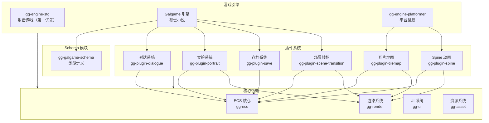
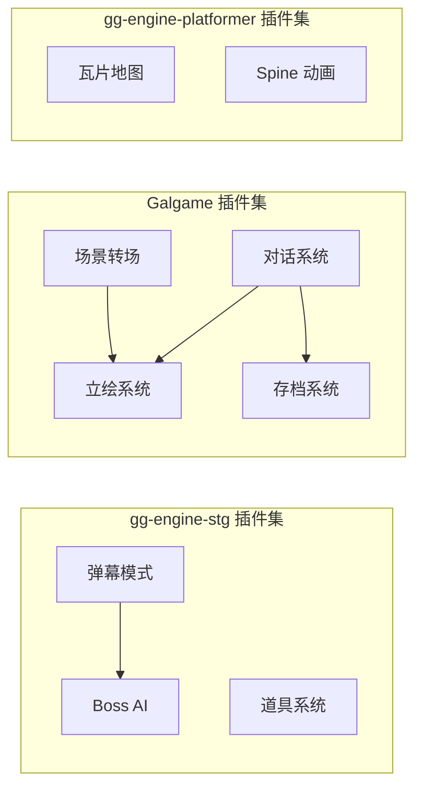

# GG Engines & Plugins 开发计划

## 项目概览

GG Engines 是 GG 游戏引擎的具体游戏引擎实现，采用元引擎架构，通过插件组合生成特定类型的游戏引擎。Plugins 是官方提供的领域专用插件模块，为引擎提供可复用的功能组件。

### 核心设计原则

1. **元引擎架构**：引擎是插件的静态组合，编译时确定
2. **插件化设计**：功能模块独立，通过 ECS 世界通信
3. **Schema 内聚**：类型定义与引擎代码同模块，避免过度分离
4. **ECS 驱动**：所有游戏逻辑通过 ECS 系统执行

### 现有引擎

| 引擎 | 路径 | 职责 |
|------|------|------|
| gg-engine | `projects/engines/gg-engine` | 无特化引擎（MVP 重点） |
| gg-engine-stg | `../gnostic-galgame/projects/gg-engine-stg` | 射击游戏引擎（独立项目） |
| gg-engine-galgame | `../gnostic-galgame/projects/gg-engine-galgame` | 视觉小说引擎（独立项目） |
| gg-engine-platformer | `../gnostic-galgame/projects/gg-engine-platformer` | 平台跳跃引擎（独立项目） |

> **说明**：特化引擎已迁移至独立项目 `gnostic-galgame`，便于产品分离和独立发布。

### 现有插件

| 插件 | 路径 | 职责 |
|------|------|------|
| gg-plugin-dialogue | `projects/engines/gg-plugin-dialogue` | 对话系统 |
| gg-plugin-portrait | `projects/engines/gg-plugin-portrait` | 立绘系统 |
| gg-plugin-save | `projects/engines/gg-plugin-save` | 存档系统 |
| gg-plugin-scene-transition | `projects/engines/gg-plugin-scene-transition` | 场景转场 |
| gg-plugin-spine | `projects/engines/gg-plugin-spine` | Spine 动画 |
| gg-plugin-tilemap | `projects/engines/gg-plugin-tilemap` | 瓦片地图 |

### 示例项目（游戏）

| 示例 | 路径 | 关联引擎 | 状态 |
|------|------|---------|------|
| my-first-stg | `examples/my-first-stg` | STG | 活跃（优先级第一） |
| my-first-galgame | `examples/my-first-galgame` | Galgame | 活跃 |
| my-first-platformer | `examples/my-first-platformer` | Platformer | 活跃 |
| my-first-rpg | `examples/my-first-rpg` | RPG（规划中） | 规划 |

---

# gg-engine 无特化引擎（MVP 重点）

- **负责模块**：gg-engine
- **大致进度**：15%（原计划未评估）
- **状态**：⚠️ **存根实现** - 仅有框架代码
- **本月工作重点**：
  - 实现引擎主循环（游戏循环、帧率控制）
  - 集成渲染后端（WGPU 渲染器）
  - 集成脚本引擎（Valkyrie 脚本执行）
  - 实现资源加载（AssetServer 集成）
  - 实现插件系统（PluginManager 集成）
- **未完成工作**：
  - ❌ run() 主循环实现（当前为空实现）
  - ❌ init_window() 窗口初始化（当前为空实现）
  - ❌ load_plugins() 插件加载（当前为空实现）
  - ❌ init_systems() 系统初始化（当前为空实现）
  - ❌ main_loop() 主循环（当前为空实现）
- **长期目标**：
  - 完整的无特化引擎
  - 支持插件组合生成特化引擎
  - 支持游戏 UI 体系（*.shader + *.prefab）
- **相关文件**：
  - gg-engine: `projects/engines/gg-engine/src/lib.rs`
  - gg-engine: `projects/engines/gg-engine/src/engine.rs`

---

# ~~STG 引擎组~~（已迁移）

> **说明**：gg-engine-stg 已迁移至独立项目 `gnostic-galgame`，便于产品分离和独立发布。

- **负责模块**：gg-engine-stg
- **项目路径**：`../gnostic-galgame/projects/gg-engine-stg`
- **状态**：已迁移至独立项目
- **建议**：在独立项目中维护和开发

---

# ~~Galgame 引擎组~~（已迁移）

> **说明**：gg-engine-galgame 已迁移至独立项目 `gnostic-galgame`，便于产品分离和独立发布。

- **负责模块**：gg-engine-galgame
- **项目路径**：`../gnostic-galgame/projects/gg-engine-galgame`
- **状态**：已迁移至独立项目
- **建议**：在独立项目中维护和开发

---

# ~~Platformer 引擎组~~（已迁移）

> **说明**：gg-engine-platformer 已迁移至独立项目 `gnostic-galgame`，便于产品分离和独立发布。

- **负责模块**：gg-engine-platformer
- **项目路径**：`../gnostic-galgame/projects/gg-engine-platformer`
- **状态**：已迁移至独立项目
- **建议**：在独立项目中维护和开发

---

# 对话系统插件组

- **负责模块**：gg-plugin-dialogue
- **大致进度**：70%（原计划 75%）
- **本月工作重点**：
  - 完善对话节点执行器
  - 实现表达式解析器
  - 完善命令系统
  - 优化历史记录管理
  - 实现对话跳转和条件分支
- **长期目标**：
  - 完整的对话系统
  - 支持变量和条件表达式
  - 支持对话预览编辑器
  - 支持多语言文本
- **相关文件**：
  - gg-plugin-dialogue: `projects/engines/gg-plugin-dialogue/src/lib.rs`

---

# 立绘系统插件组

- **负责模块**：gg-plugin-portrait
- **大致进度**：60%（原计划 65%）
- **本月工作重点**：
  - 完善立绘布局系统
  - 实现立绘动画效果
  - 优化 Z 排序算法
  - 支持立绘特效
  - 实现立绘切换过渡
- **长期目标**：
  - 完整的立绘系统
  - 支持多种立绘格式
  - 支持立绘编辑器
  - 支持动态表情
- **相关文件**：
  - gg-plugin-portrait: `projects/engines/gg-plugin-portrait/src/lib.rs`

---

# 存档系统插件组

- **负责模块**：gg-plugin-save
- **大致进度**：50%（原计划 55%）
- **本月工作重点**：
  - 完善存档管理器
  - 实现自动存档功能
  - 完善存档 UI
  - 支持存档加密
  - 实现云存档接口
- **长期目标**：
  - 完整的存档系统
  - 支持多存档槽位
  - 支持云存档
  - 支持存档迁移
- **相关文件**：
  - gg-plugin-save: `projects/engines/gg-plugin-save/src/lib.rs`

---

# 场景转场插件组

- **负责模块**：gg-plugin-scene-transition
- **大致进度**：45%（原计划 50%）
- **本月工作重点**：
  - 完善转场效果库
  - 实现氛围滤镜
  - 优化转场性能
  - 支持自定义转场
  - 实现场景管理器
- **长期目标**：
  - 丰富的转场效果
  - 支持自定义着色器转场
  - 支持转场预览
  - 支持转场链
- **相关文件**：
  - gg-plugin-scene-transition: `projects/engines/gg-plugin-scene-transition/src/lib.rs`

---

# Spine 动画插件组

- **负责模块**：gg-plugin-spine
- **大致进度**：40%（原计划 45%）
- **本月工作重点**：
  - 完善 Spine 数据解析
  - 实现骨骼动画播放
  - 支持皮肤切换
  - 实现事件系统
  - 优化渲染性能
- **长期目标**：
  - 完整的 Spine 支持
  - 支持 Spine 4.x 格式
  - 支持动画混合
  - 支持 IK 约束
- **相关文件**：
  - gg-plugin-spine: `projects/engines/gg-plugin-spine/src/lib.rs`

---

# 瓦片地图插件组

- **负责模块**：gg-plugin-tilemap
- **大致进度**：45%（原计划 50%）
- **本月工作重点**：
  - 完善瓦片渲染系统
  - 实现地图加载器
  - 支持瓦片动画
  - 实现相机跟随
  - 完善碰撞检测
- **长期目标**：
  - 完整的瓦片地图系统
  - 支持 Tiled 地图格式
  - 支持地图编辑器
  - 支持多图层
- **相关文件**：
  - gg-plugin-tilemap: `projects/engines/gg-plugin-tilemap/src/lib.rs`

---

## 模块完成度详细评估

### gg-engine（MVP 重点）

- **完成度**：15%
- **状态**：⚠️ **存根实现** - 仅有框架代码
- **未完成功能**：
  - run() 主循环实现（当前为空实现）
  - init_window() 窗口初始化（当前为空实现）
  - load_plugins() 插件加载（当前为空实现）
  - init_systems() 系统初始化（当前为空实现）
  - main_loop() 主循环（当前为空实现）

### ~~gg-engine-stg~~（已迁移）

- **完成度**：N/A（已迁移至独立项目）
- **状态**：已迁移至 `../gnostic-galgame/projects/gg-engine-stg`

### ~~gg-galgame~~（已迁移）

- **完成度**：N/A（已迁移至独立项目）
- **状态**：已迁移至 `../gnostic-galgame/projects/gg-engine-galgame`

### ~~gg-platformer~~（已迁移）

- **完成度**：N/A（已迁移至独立项目）
- **状态**：已迁移至 `../gnostic-galgame/projects/gg-engine-platformer`

### gg-plugin-dialogue

- **完成度**：70%（原计划 75%）
- **未完成功能**：
  - 表达式解析
  - 条件分支
  - 变量系统

### gg-plugin-portrait

- **完成度**：60%（原计划 65%）
- **未完成功能**：
  - 立绘动画
  - 特效系统
  - 表情切换

### gg-plugin-save

- **完成度**：50%（原计划 55%）
- **未完成功能**：
  - 自动存档
  - 存档加密
  - 云存档

### gg-plugin-scene-transition

- **完成度**：45%（原计划 50%）
- **未完成功能**：
  - 更多转场效果
  - 氛围滤镜
  - 自定义转场

### gg-plugin-spine

- **完成度**：40%（原计划 45%）
- **未完成功能**：
  - 皮肤系统
  - 事件系统
  - 动画混合

### gg-plugin-tilemap

- **完成度**：45%（原计划 50%）
- **未完成功能**：
  - 瓦片动画
  - 碰撞优化
  - Tiled 格式支持

---

## 架构图

---

## 插件依赖关系

---

## 开发里程碑

### Phase 0: 插件模块迁移 - ⏳ 进行中

- [ ] 迁移 gg-plugin-dialogue 到 plugins 目录
- [ ] 迁移 gg-plugin-portrait 到 plugins 目录
- [ ] 迁移 gg-plugin-save 到 plugins 目录
- [ ] 迁移 gg-plugin-scene-transition 到 plugins 目录
- [ ] 迁移 gg-plugin-spine 到 plugins 目录
- [ ] 迁移 gg-plugin-tilemap 到 plugins 目录
- [ ] 更新工作区 Cargo.toml 依赖路径
- [ ] 验证迁移后编译通过

### Phase 2: gg-engine-stg 引擎完善 (Week 5-8)

- [ ] 实现关卡系统
- [ ] 添加音效和特效
- [ ] 优化渲染性能

### Phase 3: Galgame 核心 (Week 9-12)

- [ ] 完善对话脚本编译器
- [ ] 实现增量编译
- [ ] 完善打字机效果
- [ ] 实现变量和条件分支
- [ ] 完善立绘布局系统

### Phase 4: Galgame 完善 (Week 13-16)

- [ ] 实现存档系统加密
- [ ] 完善转场效果库
- [ ] 实现立绘动画
- [ ] 完善对话 UI
- [ ] 集成编辑器支持

### Phase 5: gg-engine-platformer 核心 (Week 17-20)

- [ ] 完善物理系统
- [ ] 实现敌人 AI
- [ ] 完善瓦片地图
- [ ] 实现关卡系统
- [ ] 完善碰撞检测

### Phase 6: 插件完善 (Week 21-24)

- [ ] 完善 Spine 动画插件
- [ ] 实现云存档接口
- [ ] 支持自定义转场
- [ ] 支持 Tiled 地图格式
- [ ] 完善插件文档

---

## 文档计划

### 技术文档

- [ ] 引擎架构文档
- [ ] 插件开发指南
- [ ] API 参考文档
- [ ] 脚本语言规范

### 用户文档

- [ ] 引擎使用指南
- [ ] 插件配置说明
- [ ] 示例项目文档

---

## 发布计划

### 版本规划

- **v0.1.0**：gg-engine-stg 引擎基础功能
- **v0.2.0**：gg-engine-stg 引擎完善
- **v0.3.0**：Galgame 引擎基础功能
- **v0.4.0**：Galgame 引擎完善
- **v0.5.0**：gg-engine-platformer 引擎基础功能
- **v0.6.0**：插件系统完善
- **v1.0.0**：稳定版本

### 发布标准

- 所有测试通过
- 代码覆盖率达到 70% 以上
- API 文档完善
- 性能达到 60fps
